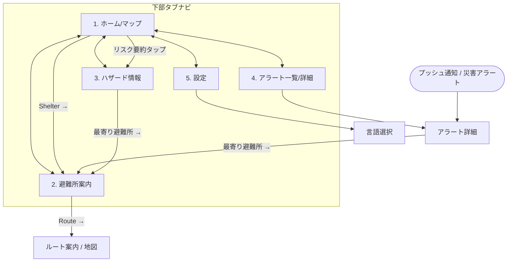

# 全体 UI デザイン・画面設計（ワイヤーフレーム）

> 関連 Issue: #7
> 対象: SafeTabi アプリ全体（スマホ / Web）の画面構成・画面遷移・地図ライブラリ選定

実装 Issue を細分化する前提となる全体設計。サービスコンセプト（[HANDOFF.md](./HANDOFF.md)）の優先順位—①リアルタイム災害アラート ②最寄り避難所・ルート案内 ③現在地ハザードリスク ④多言語—を画面に落とし込む。

## 1. 画面一覧

| # | 画面 | 主目的 | コンセプト | ワイヤーフレーム |
|---|---|---|---|---|
| 1 | ホーム / マップ | 現在地と「いま危険か」を一目で | ①③ | [home-map.html](../design/wireframes/home-map.html) |
| 2 | 避難所案内 | 最寄り避難所一覧＋ルート | ② | [shelter-guide.html](../design/wireframes/shelter-guide.html) |
| 3 | ハザード情報 | 現在地周辺の洪水/土砂/津波リスク | ③ | [design/hazard-map/](../design/hazard-map/)（#22 で作成済み） |
| 4 | アラート詳細 | 警報・避難指示の詳細と行動 | ① | [alert-detail.html](../design/wireframes/alert-detail.html) |
| 5 | 設定 | 言語・通知・オフライン | ④ | [settings.html](../design/wireframes/settings.html) |

> ハザード情報画面は #22 で詳細モックを作成済みのため、本 Issue では重複させず既存モックを参照する。

## 2. 画面遷移図

下部タブで主要 5 画面を相互遷移。災害アラートはタブに依存せず**最優先のオーバーレイ／プッシュ通知**として割り込み、タップでアラート詳細へ。

## 3. 地図ライブラリ選定

**結論: MapLibre GL JS を採用**（#22 の決定を全体方針として確定）。

| 候補 | ライセンス/コスト | 評価 |
|---|---|---|
| **MapLibre GL JS** ✅ | OSS（BSD）・API キー不要・無料 | ベクタ/ラスタ両対応。地理院タイル・重ねるハザードマップを重畳可。Web/モバイル WebView 共通。コスト最小化方針（[decisions.md](./decisions.md)）に合致 |
| Leaflet | OSS・無料 | 軽量だがベクタタイル/3D が弱く、重畳・スタイル表現で見劣り |
| Google Maps | 従量課金（API キー必須） | 高機能だが**有料・商用コスト増**で方針に反する |

- ブラウザ実行ライブラリのため Next.js では **`ssr:false` のクライアント専用コンポーネント**として読み込む（#3 の Edge ランタイム制約とは無関係。#23 で確認済み）。
- ベース地図＝地理院タイル、ハザード重畳＝重ねるハザードマップ。詳細は [hazard-map-display-design.md](./hazard-map-display-design.md)。

## 4. UX 方針（非常時に強い設計）

非常時は認知負荷が極端に上がる前提で設計する。

- **情報の優先順位を画面上の位置で表現**: 災害アラート＝最上部の赤バー／割り込み、次に現在地リスク、その下に行動導線（避難所）。
- **1 画面 1 主要アクション**: ホームの「Shelter →」、アラート詳細の「最寄り避難所 →」のように、迷わせない単一の主 CTA。
- **警戒レベルの色・数字を統一**（レベル1〜5 / 気象庁準拠）。色は赤=危険・緑=安全を一貫使用。
- **ピクトグラム優先**（言語非依存）: タブ、災害種別（🌊洪水/⛰️土砂/🌀津波）、行動指示（避難所・河川回避・持ち物）をアイコンで先に伝え、テキストは補助。実装では絵文字を**正式ピクトグラム（SVG・JIS Z8210 / ISO 7001 系）**に差し替える。
- **オフライン前提**: 通信不安定でも判定・避難所情報を継続表示（#22 / #5 のキャッシュ方針）。地図画像が出せない時はテキスト＋現在地で代替。

## 5. 多言語前提の UI テキスト設計（#8 連動）

- 対応言語: 英語・日本語・簡体字中国語・繁体字中国語・韓国語。
- ワイヤーフレームは**二言語併記（EN/JA）**で情報密度を確認。実装では i18n キーで全言語を出し分ける（`<html lang>` も動的化）。
- 翻訳対象は**自前 UI（ラベル・凡例・判定文・行動指示）**。公式タイルは色ゾーンで言語非依存。アラート本文は LLM 翻訳（HANDOFF.md）。
- レイアウトは**テキスト伸縮に耐える**設計（ボタン固定幅を避け、折り返し許容）。

## 6. 共通コンポーネント

- **下部タブナビ**（5 タブ: ホーム/避難所/危険度/速報/設定）— 全画面共通。
- **災害アラートバー / 警戒レベルバッジ** — レベル色・数字を共通化。
- **出典表示** — 用途で二系統（オンライン表示＝地理院/ハザードマップポータル、判定/避難所データ＝国土数値情報/気象庁）を常時表示（#22 / #23 申し送り）。
- **避難所カード** — 距離・所要時間・対応災害種別・ルート導線。

## 7. 成果物（Issue #7 チェックリスト）

- [x] 画面一覧・画面遷移図（本書 §1, §2）
- [x] 主要画面のワイヤーフレーム（`design/wireframes/`＋ハザードは #22 参照）
- [x] 地図ライブラリ選定（MapLibre GL JS・本書 §3）

## 8. 申し送り・依存

- UI モック/ワイヤーフレームの **Claude Design 同期は後回し**（接続有効化後に push。#22 と同方針）。
- 依存: #8 多言語方式 / #22 ハザード画面 / #5・#24 配信 / #3 ホスティング。
- 実装フェーズで正式ピクトグラム素材（SVG）とデザイントークン（色・余白・タイポ）を確定する。
